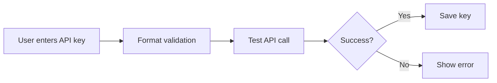
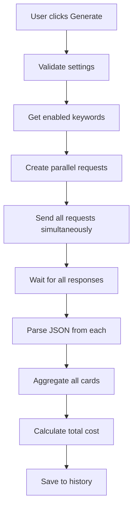

# API Documentation

## OpenRouter Integration

The News Report Generator integrates with OpenRouter's API to access various AI models for news search and analysis.

## Base URL

```
https://openrouter.ai/api/v1
```

## Authentication

All API requests require an API key in the Authorization header:

```http
Authorization: Bearer sk-or-v1-{your-key}
```

### API Key Format

OpenRouter API keys follow this pattern:

- Prefix: `sk-or-v1-`
- Followed by: 64 hexadecimal characters
- Example: `sk-or-v1-abcdef1234567890...` (64 chars total after prefix)

### Getting an API Key

1. Visit [https://openrouter.ai/keys](https://openrouter.ai/keys)
2. Sign up or log in
3. Generate a new API key
4. Add allowed origins in your OpenRouter dashboard (e.g., `http://localhost:3000`)

## Endpoints Used

### 1. Fetch Available Models

**Endpoint:** `GET /models`

**Description:** Retrieves the list of all available AI models with their pricing information.

**Headers:**

```http
Authorization: Bearer {api-key}
X-Title: News Report Generator
```

**Response:**

```json
{
  "data": [
    {
      "id": "anthropic/claude-3-sonnet",
      "name": "Claude 3 Sonnet",
      "pricing": {
        "prompt": "0.000003",
        "completion": "0.000015"
      }
    }
  ]
}
```

**Implementation:**

```typescript
const response = await fetch('https://openrouter.ai/api/v1/models', {
  headers: {
    Authorization: `Bearer ${apiKey}`,
    'X-Title': 'News Report Generator',
  },
});
```

### 2. Chat Completions (News Search)

**Endpoint:** `POST /chat/completions`

**Description:** Sends search queries to AI models with online search capabilities.

**Headers:**

```http
Authorization: Bearer {api-key}
Content-Type: application/json
X-Title: News Report Generator
HTTP-Referer: {your-origin}
```

**Request Body:**

```json
{
  "model": "model-id:online",
  "messages": [
    {
      "role": "user",
      "content": "Search instructions and keyword"
    }
  ],
  "temperature": 0.5,
  "max_tokens": 2000,
  "response_format": { "type": "json_object" },
  "top_p": 0.9,
  "frequency_penalty": 0.5,
  "presence_penalty": 0.3
}
```

**Model Parameters:**

The application supports 13+ model parameters to improve accuracy and consistency:

| Parameter            | Type         | Default     | Description                                  |
| -------------------- | ------------ | ----------- | -------------------------------------------- |
| `temperature`        | number (0-2) | 0.5         | Controls randomness. Lower = more factual    |
| `max_tokens`         | number       | 2000        | Maximum response length. Controls cost       |
| `response_format`    | string       | json_object | Enforces valid JSON output                   |
| `top_p`              | number (0-1) | 0.9         | Nucleus sampling. Alternative to temperature |
| `frequency_penalty`  | number (0-2) | 0.5         | Reduces word repetition                      |
| `presence_penalty`   | number (0-2) | 0.3         | Encourages topic diversity                   |
| `reasoning`          | string       | -           | For O1/O3 models: low/medium/high            |
| `include_reasoning`  | boolean      | -           | Shows model's thought process                |
| `stop`               | string[]     | -           | Stop sequences                               |
| `seed`               | number       | -           | For reproducible results                     |
| `top_k`              | number       | -           | Limits token sampling                        |
| `min_p`              | number       | -           | Minimum probability threshold                |
| `repetition_penalty` | number (1-2) | -           | Reduces repetition                           |

**Note:** All parameters are optional. The app provides optimized defaults for news search.

**Response:**

```json
{
  "choices": [
    {
      "message": {
        "content": "{\"stories\": [{\"title\": \"...\", ...}]}"
      }
    }
  ],
  "usage": {
    "prompt_tokens": 150,
    "completion_tokens": 450
  }
}
```

**Implementation:**

```typescript
const normalizedParameters = normalizeModelParameters(
  settings.modelParameters,
  modelId + ':online'
);

const response = await fetch('https://openrouter.ai/api/v1/chat/completions', {
  method: 'POST',
  headers: {
    Authorization: `Bearer ${apiKey}`,
    'Content-Type': 'application/json',
    'X-Title': 'News Report Generator',
    'HTTP-Referer': window.location.origin,
  },
  body: JSON.stringify({
    model: modelId + ':online',
    messages: [
      {
        role: 'user',
        content: `${searchInstructions}\n\n"${keyword}"`,
      },
    ],
    // Model parameters (all optional)
    ...normalizedParameters,
  }),
});
```

## Online Search Mode

The application automatically appends `:online` to the selected model ID to enable web search capabilities. This allows the AI to search the internet in real-time for the latest news.

### Online Mode Example

```typescript
// User selects: "anthropic/claude-3-sonnet"
// App uses: "anthropic/claude-3-sonnet:online"

const onlineModel = settings.selectedModel.includes(':online')
  ? settings.selectedModel
  : `${settings.selectedModel}:online`;
```

## Request Flow

### 1. Validation Flow



### 2. Report Generation Flow



## Error Handling

### Common Errors

#### 401 Unauthorized

- **Cause:** Invalid or expired API key
- **Solution:** Re-validate your API key

#### 403 Forbidden

- **Cause:** Origin not allowed
- **Solution:** Add your origin to OpenRouter dashboard's allowed origins

#### 429 Too Many Requests

- **Cause:** Rate limit exceeded
- **Solution:** Wait and retry, or upgrade your OpenRouter plan

#### JSON Parse Errors

- **Cause:** AI returns malformed JSON
- **Solution:** App uses multi-strategy parser (see `lib/utils.ts`)

### Error Handling Implementation

```typescript
try {
  const response = await fetch(endpoint, options);

  if (!response.ok) {
    const error = await response.json();
    throw new Error(error.error?.message || 'API request failed');
  }

  const data = await response.json();
  // Process data...
} catch (error) {
  if (error.name === 'AbortError') {
    // Handle cancellation
    return;
  }
  // Handle other errors
  console.error('API Error:', error);
}
```

## Cost Calculation

### Token Usage

Each API response includes usage statistics:

```json
{
  "usage": {
    "prompt_tokens": 150,
    "completion_tokens": 450,
    "total_tokens": 600
  }
}
```

### Cost Formula

```typescript
const promptCost = (promptTokens / 1_000_000) * model.pricing.prompt;
const completionCost =
  (completionTokens / 1_000_000) * model.pricing.completion;
const totalCost = promptCost + completionCost;
```

### Estimated vs Actual Cost

**Estimated Cost:**

- Calculated before generation
- Based on ~800 tokens per keyword
- Formula: `(enabledKeywords * 800 / 1M) * model.totalCostPer1M`

**Actual Cost:**

- Calculated from actual API responses
- Tracked in real-time during generation
- Summed across all parallel requests

## Rate Limits

OpenRouter implements rate limits based on your plan:

- **Free tier:** Limited requests per minute
- **Paid tier:** Higher limits based on plan
- Check your dashboard for current limits

## Best Practices

### 1. API Key Security

```typescript
// ✅ DO: Store in environment variables or secure storage
const apiKey = process.env.OPENROUTER_API_KEY;

// ❌ DON'T: Hardcode in source code
const apiKey = 'sk-or-v1-abc123...'; // Never do this!
```

### 2. Error Handling

```typescript
// ✅ DO: Implement comprehensive error handling
try {
  await apiCall();
} catch (error) {
  handleError(error);
}

// ❌ DON'T: Ignore errors
await apiCall(); // Unhandled errors will crash
```

### 3. Request Cancellation

```typescript
// ✅ DO: Implement abort controllers for long requests
const controller = new AbortController();
fetch(url, { signal: controller.signal });

// Allow user to cancel
cancelButton.onclick = () => controller.abort();
```

### 4. Cost Management

```typescript
// ✅ DO: Show estimated costs before generation
calculateEstimatedCost(keywords, model);

// ✅ DO: Track actual costs in real-time
updateCostDisplay(actualCost);
```

## Testing the API

### Using cURL

```bash
# Test authentication
curl -X GET https://openrouter.ai/api/v1/models \
  -H "Authorization: Bearer sk-or-v1-YOUR-KEY"

# Test chat completion
curl -X POST https://openrouter.ai/api/v1/chat/completions \
  -H "Authorization: Bearer sk-or-v1-YOUR-KEY" \
  -H "Content-Type: application/json" \
  -d '{
    "model": "anthropic/claude-3-haiku:online",
    "messages": [{"role": "user", "content": "Latest AI news"}]
  }'
```

### Using the App

1. Go to Settings tab
2. Enter your API key
3. Click "Validate & Save"
4. Click "Fetch Models"
5. Select a model
6. Add keywords
7. Go to News tab
8. Click "Generate Report"

## Resources

- [OpenRouter Documentation](https://openrouter.ai/docs)
- [OpenRouter Models](https://openrouter.ai/models)
- [OpenRouter API Keys](https://openrouter.ai/keys)
- [OpenRouter Pricing](https://openrouter.ai/docs#pricing)

## Support

For API-related issues:

- Check [OpenRouter Status](https://status.openrouter.ai/)
- Contact OpenRouter support via their dashboard
- Review [OpenRouter Discord](https://discord.gg/openrouter)
