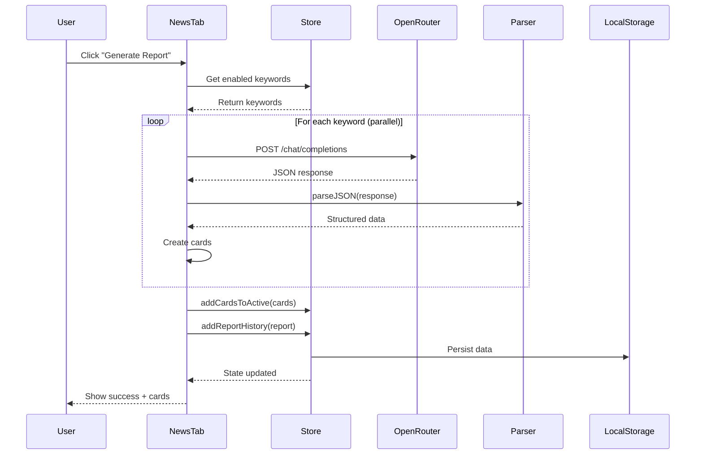
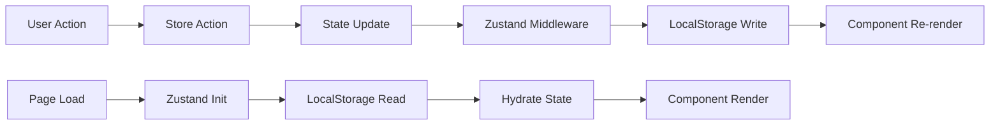

# Architecture Documentation

## Overview

The News Report Generator is a modern Next.js 14 application that uses AI to aggregate and analyze news across multiple topics. It features a clean, component-based architecture with client-side state management and no backend dependencies.

## Technology Stack

### Core Framework

- **Next.js 14** - React framework with App Router
- **React 18** - UI library with hooks
- **TypeScript** - Type-safe JavaScript

### Styling

- **Tailwind CSS** - Utility-first CSS framework
- **PostCSS** - CSS processing
- **class-variance-authority** - Variant styling utilities
- **clsx** + **tailwind-merge** - Class name management

### State Management

- **Zustand** - Lightweight state management
- **Zustand Persist** - LocalStorage persistence

### UI Components

- **Lucide React** - Icon library
- Custom UI components in `components/ui/`

### Testing

- **Jest** - Testing framework
- **React Testing Library** - Component testing
- **@testing-library/jest-dom** - DOM matchers

### Code Quality

- **ESLint** - Linting
- **Prettier** - Code formatting
- **TypeScript** - Type checking
- **Husky** - Git hooks
- **lint-staged** - Pre-commit checks

## Project Structure

```
.
├── app/                      # Next.js App Router
│   ├── layout.tsx           # Root layout with metadata
│   ├── page.tsx             # Home page with tab navigation
│   └── globals.css          # Global styles and Tailwind imports
│
├── components/              # React components
│   ├── ui/                  # Reusable UI primitives
│   │   ├── button.tsx      # Button component
│   │   ├── input.tsx       # Input component
│   │   ├── switch.tsx      # Toggle switch
│   │   └── textarea.tsx    # Textarea component
│   │
│   ├── SettingsTab.tsx     # Settings configuration UI
│   ├── NewsTab.tsx         # News generation and display
│   ├── ActiveCardsTab.tsx  # Active news cards view
│   ├── ArchivedCardsTab.tsx # Archived news cards view
│   ├── HistoryTab.tsx      # Generation history view
│   ├── NewsCard.tsx        # Individual news card display
│   ├── ReportGroup.tsx     # Grouped news cards by keyword
│   └── DateFilterDropdown.tsx # Date range filter
│
├── lib/                     # Utility libraries
│   ├── store.ts            # Zustand global state store
│   └── utils.ts            # Helper functions
│
├── __tests__/               # Test files
│   ├── layout.test.tsx
│   ├── page.test.tsx
│   ├── NewsTab.test.tsx
│   ├── store.test.ts
│   └── utils.test.ts
│
├── docs/                    # Documentation
│   ├── API.md              # OpenRouter API documentation
│   ├── ARCHITECTURE.md     # This file
│   └── agent-policies/     # Development policies
│
├── public/                  # Static assets
│
├── next.config.js          # Next.js configuration
├── tailwind.config.ts      # Tailwind configuration
├── tsconfig.json           # TypeScript configuration
├── jest.config.js          # Jest configuration
├── package.json            # Dependencies and scripts
│
├── README.md               # User guide
├── DEVELOPMENT.md          # Developer guide
├── CONTRIBUTING.md         # Contribution guidelines
└── DEPLOYMENT.md           # Deployment instructions
```

## Architecture Patterns

### 1. Client-Side First Architecture

The application runs entirely in the browser with no backend server:

```
┌─────────────────────────────────────────┐
│           Browser (Client)              │
│  ┌───────────────────────────────────┐  │
│  │      Next.js App (React)          │  │
│  │  ┌─────────────────────────────┐  │  │
│  │  │   Zustand Store (State)     │  │  │
│  │  └─────────────────────────────┘  │  │
│  │  ┌─────────────────────────────┐  │  │
│  │  │   LocalStorage (Persist)    │  │  │
│  │  └─────────────────────────────┘  │  │
│  └───────────────────────────────────┘  │
│              ▲                           │
│              │ HTTPS                     │
│              ▼                           │
│  ┌───────────────────────────────────┐  │
│  │    OpenRouter API (External)      │  │
│  └───────────────────────────────────┘  │
└─────────────────────────────────────────┘
```

**Benefits:**

- No server costs
- Instant deployment
- Simple architecture
- Enhanced privacy (data stays in browser)

### 2. State Management with Zustand

Centralized state management with automatic persistence:

```typescript
// Store definition
interface StoreState {
  settings: Settings;
  models: Model[];
  activeCards: Card[];
  // ... actions
}

// Persist middleware
const useStore = create<StoreState>()(
  persist(
    set => ({
      // Initial state
      settings: {
        /*...*/
      },

      // Actions
      setApiKey: key =>
        set(state => ({
          settings: { ...state.settings, apiKey: key },
        })),
    }),
    { name: 'news-report-generator-storage' }
  )
);
```

**Data Flow:**

```
User Action → Store Action → State Update → LocalStorage → Component Re-render
```

### 3. Component Architecture

#### Layout Hierarchy

```
RootLayout (app/layout.tsx)
└── Home (app/page.tsx)
    ├── SettingsTab
    │   ├── Input (API Key)
    │   ├── Button (Fetch Models)
    │   ├── Input (Keywords)
    │   └── Textarea (Prompts)
    │
    └── NewsTab
        ├── Generate Tab
        │   ├── Button (Generate)
        │   └── Progress Display
        │
        ├── ActiveCardsTab
        │   ├── DateFilterDropdown
        │   └── ReportGroup[]
        │       └── NewsCard[]
        │
        ├── ArchivedCardsTab
        │   ├── DateFilterDropdown
        │   └── ReportGroup[]
        │       └── NewsCard[]
        │
        └── HistoryTab
            └── History Entries[]
```

#### Component Responsibilities

| Component            | Responsibility                  |
| -------------------- | ------------------------------- |
| `Home`               | Tab navigation and layout       |
| `SettingsTab`        | Configuration management        |
| `NewsTab`            | Report generation orchestration |
| `ActiveCardsTab`     | Display unread news             |
| `ArchivedCardsTab`   | Display read news               |
| `HistoryTab`         | Show generation history         |
| `NewsCard`           | Display individual story        |
| `ReportGroup`        | Group cards by keyword          |
| `DateFilterDropdown` | Filter cards by date            |

### 4. Data Flow Architecture

#### Report Generation Flow



#### State Persistence Flow



### 5. Parallel Processing Architecture

The app uses true parallel processing for keyword searches:

```typescript
// All searches start simultaneously
const searchPromises = keywords.map(async keyword => {
  const response = await fetch(/* API call */);
  return { cards, cost };
});

// Wait for ALL to complete
const results = await Promise.all(searchPromises);

// Aggregate results
results.forEach(result => {
  allCards.push(...result.cards);
  totalCost += result.cost;
});
```

**Benefits:**

- Faster total execution time
- Better user experience
- Real-time progress updates
- Independent error handling per keyword

## Key Design Decisions

### 1. No Backend Server

**Decision:** Build a fully client-side application

**Rationale:**

- Simpler deployment (static hosting)
- No server costs
- Better privacy (API key stays in browser)
- Reduced complexity

**Trade-offs:**

- API key exposed in browser (mitigated by OpenRouter's origin restrictions)
- No server-side rate limiting
- Data limited to browser storage

### 2. Zustand with Persistence

**Decision:** Use Zustand instead of Redux/Context

**Rationale:**

- Simpler API
- Less boilerplate
- Built-in persistence
- Better TypeScript support

**Trade-offs:**

- Less ecosystem than Redux
- Limited DevTools

### 3. Dynamic Component Loading

**Decision:** Use `next/dynamic` for main tabs

```typescript
const SettingsTab = dynamic(() => import('@/components/SettingsTab'), {
  ssr: false,
});
```

**Rationale:**

- Prevents hydration mismatches with localStorage
- Reduces initial bundle size
- Improves page load performance

### 4. JSON-First AI Responses

**Decision:** Request structured JSON directly from AI

**Rationale:**

- No need for separate formatting stage
- Faster processing
- Lower API costs
- Simpler parsing

**Implementation:**

- Detailed JSON schema in prompt
- Multi-strategy JSON parser for robustness
- Fallback error handling

### 5. Card-Based UI

**Decision:** Individual "card" for each news story

**Rationale:**

- Easy to scan
- Clear information hierarchy
- Simple archive/unarchive flow
- Mobile-friendly

## Performance Optimizations

### 1. Code Splitting

```typescript
// Dynamic imports reduce initial bundle
const SettingsTab = dynamic(() => import('@/components/SettingsTab'), {
  ssr: false,
});
```

### 2. Memoization

```typescript
// Prevent unnecessary re-renders
const filteredCards = useMemo(() => {
  return cards.filter(card => /* filter logic */);
}, [cards, filterCriteria]);
```

### 3. Optimistic Updates

```typescript
// Update UI immediately, persist in background
const toggleKeyword = (id: string) => {
  set(state => ({
    settings: {
      ...state.settings,
      keywords: state.settings.keywords.map(k =>
        k.id === id ? { ...k, enabled: !k.enabled } : k
      ),
    },
  }));
  // Zustand persist handles localStorage asynchronously
};
```

### 4. Request Cancellation

```typescript
// Allow users to cancel long-running operations
const abortController = new AbortController();
fetch(url, { signal: abortController.signal });

// On stop button click
abortController.abort();
```

## Security Considerations

### 1. API Key Storage

**Current:** Stored in browser localStorage
**Risk:** Accessible to browser extensions and XSS
**Mitigation:**

- OpenRouter origin restrictions
- HTTPS only
- No third-party scripts

### 2. Content Security Policy

**Recommendation:** Add CSP headers

```typescript
// next.config.js
const securityHeaders = [
  {
    key: 'Content-Security-Policy',
    value: "default-src 'self'; connect-src 'self' https://openrouter.ai",
  },
];
```

### 3. Input Validation

```typescript
// Validate API key format before use
export function isValidOpenRouterApiKey(key: string): boolean {
  return /^sk-or-v1-[a-f0-9]{64}$/i.test(key.trim());
}
```

## Testing Strategy

### Unit Tests

```typescript
// Test utility functions
describe('parseJSON', () => {
  it('handles clean JSON', () => {
    const result = parseJSON('{"key": "value"}');
    expect(result).toEqual({ key: 'value' });
  });
});
```

### Component Tests

```typescript
// Test component rendering and interactions
describe('SettingsTab', () => {
  it('validates API key on button click', async () => {
    render(<SettingsTab />);
    const input = screen.getByPlaceholderText(/sk-or-v1/);
    const button = screen.getByText(/Validate/);

    fireEvent.change(input, { target: { value: 'test-key' } });
    fireEvent.click(button);

    // Assert validation logic
  });
});
```

### Integration Tests

```typescript
// Test complete flows
describe('Report Generation Flow', () => {
  it('generates report with multiple keywords', async () => {
    // Setup store with keywords
    // Trigger generation
    // Assert cards are created
  });
});
```

## Deployment Architecture

### Static Hosting

The app compiles to static files that can be hosted anywhere:

```bash
npm run build
# Outputs to: .next/ (production build)

npm run start
# Serves production build
```

### Recommended Hosts

- **Vercel** - Zero-config, automatic HTTPS
- **Netlify** - Simple deployment, form handling
- **GitHub Pages** - Free, version controlled
- **Cloudflare Pages** - Fast global CDN

### Environment Configuration

```bash
# .env.local (optional)
NEXT_PUBLIC_APP_URL=https://your-domain.com
```

## Scalability Considerations

### Current Limitations

1. **Storage:** Limited to ~5MB localStorage
2. **History:** Can grow unbounded
3. **Cards:** Large numbers may slow UI

### Potential Solutions

1. **Implement Data Pruning:**

```typescript
// Auto-archive old cards
const pruneOldCards = () => {
  const thirtyDaysAgo = Date.now() - 30 * 24 * 60 * 60 * 1000;
  // Remove cards older than 30 days
};
```

2. **Pagination:**

```typescript
// Show cards in pages
const [page, setPage] = useState(1);
const cardsPerPage = 20;
const displayedCards = cards.slice(
  (page - 1) * cardsPerPage,
  page * cardsPerPage
);
```

3. **Virtual Scrolling:**

```typescript
// Only render visible cards
import { VirtualList } from 'react-virtual';
```

## Future Enhancements

### Potential Features

1. **Export Functionality**
   - Export to CSV/JSON
   - Generate PDF reports

2. **Advanced Filtering**
   - Filter by rating
   - Filter by source
   - Filter by category

3. **Scheduled Generation**
   - Daily/weekly auto-generation
   - Browser notifications

4. **Data Visualization**
   - Charts for trends
   - Category distribution
   - Cost tracking over time

5. **Multi-language Support**
   - i18n integration
   - Translated UI

## Maintenance

### Regular Tasks

1. **Dependency Updates**

```bash
npm outdated
npm update
```

2. **Security Audits**

```bash
npm audit
npm audit fix
```

3. **Type Checking**

```bash
npm run type-check
```

4. **Test Coverage**

```bash
npm run test:ci
# Review coverage reports
```

## Resources

- [Next.js Documentation](https://nextjs.org/docs)
- [Zustand Documentation](https://zustand-demo.pmnd.rs/)
- [Tailwind CSS Documentation](https://tailwindcss.com/docs)
- [TypeScript Handbook](https://www.typescriptlang.org/docs/handbook/)
- [React Testing Library](https://testing-library.com/docs/react-testing-library/intro/)

## Contact & Support

For architecture questions or suggestions:

- Review the code in `lib/`, `components/`, and `app/`
- Check existing documentation in `docs/`
- Run tests to understand expected behavior
