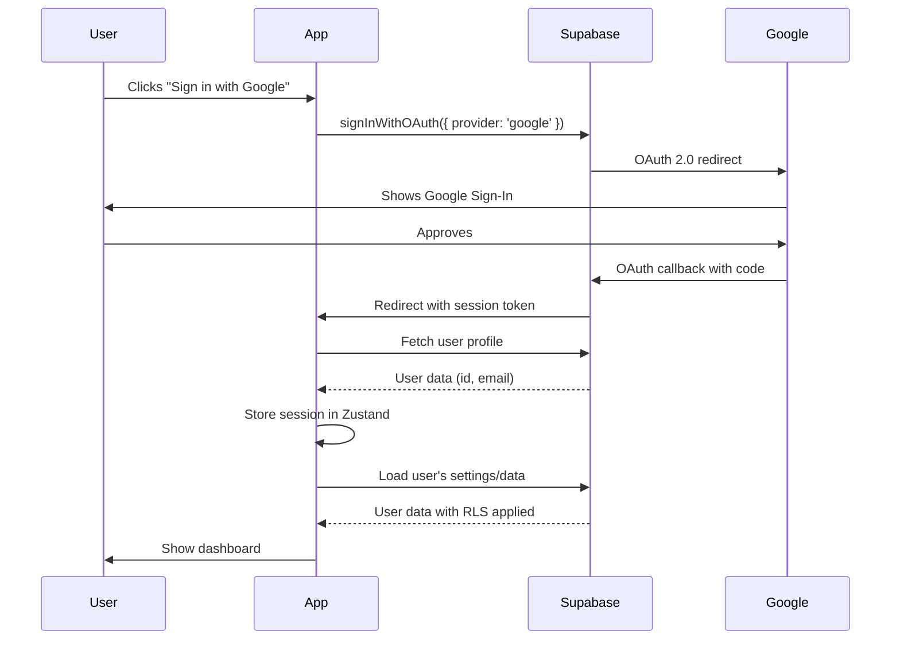

# User Authentication & Per-User Data Storage Specification

**Status:** Discussion/Planning Phase  
**Last Updated:** 2025-10-16  
**Author:** System Architect

---

## Executive Summary

This document outlines the architecture and implementation strategy for adding Google Sign-In authentication and per-user data storage to the News Report Generator. Currently, the application stores all data locally in browser localStorage, making it device-specific and single-user. This spec proposes a migration to a multi-user system where each user has their own isolated data accessible across devices.

---

## Table of Contents

1. [Current State Analysis](#current-state-analysis)
2. [Goals & Requirements](#goals--requirements)
3. [Architecture Options](#architecture-options)
4. [Recommended Architecture](#recommended-architecture)
5. [Data Model Changes](#data-model-changes)
6. [Authentication Flow](#authentication-flow)
7. [Backend Implementation](#backend-implementation)
8. [Security Considerations](#security-considerations)
9. [Migration Strategy](#migration-strategy)
10. [Implementation Phases](#implementation-phases)
11. [Cost Analysis](#cost-analysis)
12. [Open Questions](#open-questions)

---

## Current State Analysis

### What Works Well Today

- **Fully Client-Side**: No server costs, instant deployment
- **Simple Architecture**: Single store, localStorage persistence
- **Privacy-First**: API keys never leave the browser
- **Zero Auth Complexity**: No login/signup flow needed

### Current Data Storage

```typescript
// All data stored in browser localStorage via Zustand persist
localStorage['news-report-generator-storage'] = {
  settings: {
    apiKey: string,           // OpenRouter API key
    selectedModel: string,
    keywords: Keyword[],
    searchInstructions: string,
  },
  activeCards: Card[],        // Generated news cards
  archivedCards: Card[],
  reportHistory: ReportHistory[],
}
```

### Current Limitations

1. **Device-Locked**: Data exists only on one browser/device
2. **Single-User**: No concept of multiple users
3. **No Sync**: Can't access data from phone, laptop, etc.
4. **No Backup**: Clearing browser data = data loss
5. **No Sharing**: Can't share keywords/settings with team

---

## Goals & Requirements

### Must Have

1. **Google Sign-In**: Users authenticate via Google OAuth
2. **Per-User Data Isolation**: Each user has their own settings, cards, history
3. **Cross-Device Sync**: Access data from any device
4. **Data Persistence**: Data survives browser clear/reinstall
5. **Secure API Key Storage**: OpenRouter keys remain private per-user

### Should Have

1. **Smooth Migration**: Existing users can claim their localStorage data
2. **Offline Support**: Continue working when disconnected
3. **Fast Performance**: No noticeable slowdown vs. current system
4. **Simple UI**: Minimal changes to current interface

### Nice to Have

1. **Team/Workspace Sharing**: Share keywords across organization
2. **Export/Import**: Backup data to JSON
3. **Usage Analytics**: Track API costs over time per user
4. **Rate Limiting**: Prevent abuse of the service

---

## Architecture Options

### Option 1: Supabase (Recommended)

**Pros:**
- Built-in Google OAuth integration
- PostgreSQL database with Row-Level Security (RLS)
- Real-time subscriptions for live sync
- Generous free tier (50,000 monthly active users)
- Hosted solution, no DevOps needed
- TypeScript client SDK

**Cons:**
- Vendor lock-in (but data is portable)
- Learning curve for Supabase-specific features
- Must trust third-party with data

**Cost:** Free tier covers most indie use, $25/mo for Pro features

---

### Option 2: Firebase

**Pros:**
- Google-native (same auth provider)
- Excellent Google OAuth integration
- Firestore for flexible NoSQL storage
- Generous free tier
- Great documentation and ecosystem

**Cons:**
- NoSQL can be less intuitive for relational data
- More expensive at scale than Supabase
- Vendor lock-in to Google ecosystem

**Cost:** Free tier, then pay-as-you-go

---

### Option 3: Next.js API Routes + Vercel Postgres

**Pros:**
- Keep everything in Next.js monorepo
- Full control over backend logic
- Vercel-native integration
- Can use NextAuth.js for OAuth

**Cons:**
- Must build and maintain backend APIs
- More code to write and test
- Database management complexity
- Vercel Postgres costs ($0.36/GB storage)

**Cost:** Vercel hobby free, Pro $20/mo + database costs

---

### Option 4: Hybrid (localStorage + Backend Sync)

**Pros:**
- Best of both worlds: offline + sync
- Graceful degradation
- Can work without auth (like today)

**Cons:**
- Complex sync logic (conflict resolution)
- More moving parts
- Harder to reason about data source of truth

---

## Recommended Architecture

**Choice: Supabase** for the following reasons:

1. **Speed**: Fastest time-to-market
2. **Security**: Built-in RLS for data isolation
3. **Cost**: Free tier is generous
4. **Simplicity**: Less backend code to maintain
5. **Features**: Auth + DB + Storage + Realtime in one

### High-Level Architecture

```
┌─────────────────────────────────────────────────────┐
│                    Browser                          │
│  ┌───────────────────────────────────────────────┐  │
│  │         Next.js App (React)                   │  │
│  │  ┌─────────────────────────────────────────┐  │  │
│  │  │   Zustand Store (UI State)              │  │  │
│  │  └─────────────────────────────────────────┘  │  │
│  │  ┌─────────────────────────────────────────┐  │  │
│  │  │   Supabase Client (Data Layer)          │  │  │
│  │  └─────────────────────────────────────────┘  │  │
│  └───────────────────────────────────────────────┘  │
│              ▲                                       │
│              │ HTTPS (Auth, Queries)                │
└──────────────┼───────────────────────────────────────┘
               │
               ▼
┌─────────────────────────────────────────────────────┐
│              Supabase (Hosted)                      │
│  ┌───────────────────────────────────────────────┐  │
│  │   Auth (Google OAuth)                         │  │
│  └───────────────────────────────────────────────┘  │
│  ┌───────────────────────────────────────────────┐  │
│  │   PostgreSQL (User Data)                      │  │
│  │   - users, settings, cards, history           │  │
│  │   - Row-Level Security Policies               │  │
│  └───────────────────────────────────────────────┘  │
└─────────────────────────────────────────────────────┘
               │
               │ HTTPS (OpenRouter API)
               ▼
┌─────────────────────────────────────────────────────┐
│           OpenRouter API (External)                 │
└─────────────────────────────────────────────────────┘
```

---

## Data Model Changes

### Database Schema

```sql
-- Users table (managed by Supabase Auth)
-- No need to create this, Supabase handles it
-- auth.users contains: id, email, created_at, etc.

-- User settings table
CREATE TABLE user_settings (
  id uuid PRIMARY KEY DEFAULT uuid_generate_v4(),
  user_id uuid REFERENCES auth.users(id) ON DELETE CASCADE NOT NULL,
  openrouter_api_key text ENCRYPTED, -- Encrypted at rest
  selected_model text,
  search_instructions text,
  format_prompt text,
  online_enabled boolean DEFAULT true,
  created_at timestamptz DEFAULT now(),
  updated_at timestamptz DEFAULT now(),
  
  UNIQUE(user_id) -- One settings record per user
);

-- Enable RLS
ALTER TABLE user_settings ENABLE ROW LEVEL SECURITY;

-- Policy: Users can only access their own settings
CREATE POLICY "Users can manage own settings"
  ON user_settings
  FOR ALL
  USING (auth.uid() = user_id)
  WITH CHECK (auth.uid() = user_id);

-- Keywords table
CREATE TABLE keywords (
  id uuid PRIMARY KEY DEFAULT uuid_generate_v4(),
  user_id uuid REFERENCES auth.users(id) ON DELETE CASCADE NOT NULL,
  text text NOT NULL,
  enabled boolean DEFAULT true,
  created_at timestamptz DEFAULT now(),
  
  INDEX idx_keywords_user_id (user_id)
);

-- Enable RLS
ALTER TABLE keywords ENABLE ROW LEVEL SECURITY;

CREATE POLICY "Users can manage own keywords"
  ON keywords
  FOR ALL
  USING (auth.uid() = user_id)
  WITH CHECK (auth.uid() = user_id);

-- Cards table (news stories)
CREATE TABLE cards (
  id uuid PRIMARY KEY DEFAULT uuid_generate_v4(),
  user_id uuid REFERENCES auth.users(id) ON DELETE CASCADE NOT NULL,
  report_id text NOT NULL,
  keyword text NOT NULL,
  category text NOT NULL,
  title text NOT NULL,
  rating integer CHECK (rating >= 1 AND rating <= 10),
  summary text NOT NULL,
  source text,
  url text,
  date date,
  generated_at timestamptz DEFAULT now(),
  archived_at timestamptz,
  status text DEFAULT 'active' CHECK (status IN ('active', 'archived')),
  
  INDEX idx_cards_user_id (user_id),
  INDEX idx_cards_status (user_id, status),
  INDEX idx_cards_generated_at (user_id, generated_at DESC)
);

-- Enable RLS
ALTER TABLE cards ENABLE ROW LEVEL SECURITY;

CREATE POLICY "Users can manage own cards"
  ON cards
  FOR ALL
  USING (auth.uid() = user_id)
  WITH CHECK (auth.uid() = user_id);

-- Report history table
CREATE TABLE report_history (
  id uuid PRIMARY KEY DEFAULT uuid_generate_v4(),
  user_id uuid REFERENCES auth.users(id) ON DELETE CASCADE NOT NULL,
  report_id text NOT NULL UNIQUE,
  keywords text[] NOT NULL,
  total_cards integer NOT NULL,
  model_used text NOT NULL,
  cost_spent numeric(10, 6) NOT NULL,
  generated_at timestamptz DEFAULT now(),
  
  INDEX idx_report_history_user_id (user_id),
  INDEX idx_report_history_generated_at (user_id, generated_at DESC)
);

-- Enable RLS
ALTER TABLE report_history ENABLE ROW LEVEL SECURITY;

CREATE POLICY "Users can view own report history"
  ON report_history
  FOR ALL
  USING (auth.uid() = user_id)
  WITH CHECK (auth.uid() = user_id);

-- Function to automatically set updated_at
CREATE OR REPLACE FUNCTION update_updated_at_column()
RETURNS TRIGGER AS $$
BEGIN
  NEW.updated_at = now();
  RETURN NEW;
END;
$$ LANGUAGE plpgsql;

CREATE TRIGGER update_user_settings_updated_at
  BEFORE UPDATE ON user_settings
  FOR EACH ROW
  EXECUTE FUNCTION update_updated_at_column();
```

### API Key Encryption

**Critical:** OpenRouter API keys must be encrypted at rest.

**Option A: Supabase Vault (Recommended)**
```sql
-- Store encrypted API key using Supabase Vault
SELECT vault.create_secret('openrouter_key_' || user_id, api_key);

-- Retrieve decrypted key (only accessible to authenticated user)
SELECT decrypted_secret FROM vault.decrypted_secrets 
WHERE name = 'openrouter_key_' || auth.uid();
```

**Option B: Client-Side Encryption**
```typescript
// Encrypt with user's password-derived key before sending to DB
import { encrypt, decrypt } from '@/lib/crypto';

const encryptedKey = await encrypt(apiKey, userDerivedKey);
await supabase.from('user_settings').update({ 
  openrouter_api_key: encryptedKey 
});
```

---

## Authentication Flow

### Sign-In Flow



### Code Example

```typescript
// lib/auth.ts
import { createClient } from '@supabase/supabase-js';

const supabase = createClient(
  process.env.NEXT_PUBLIC_SUPABASE_URL!,
  process.env.NEXT_PUBLIC_SUPABASE_ANON_KEY!
);

export async function signInWithGoogle() {
  const { data, error } = await supabase.auth.signInWithOAuth({
    provider: 'google',
    options: {
      redirectTo: `${window.location.origin}/auth/callback`,
    },
  });
  
  if (error) throw error;
  return data;
}

export async function signOut() {
  const { error } = await supabase.auth.signOut();
  if (error) throw error;
}

export function useAuth() {
  const [user, setUser] = useState(null);
  
  useEffect(() => {
    // Get initial session
    supabase.auth.getSession().then(({ data: { session } }) => {
      setUser(session?.user ?? null);
    });
    
    // Listen for auth changes
    const { data: { subscription } } = supabase.auth.onAuthStateChange(
      (_event, session) => {
        setUser(session?.user ?? null);
      }
    );
    
    return () => subscription.unsubscribe();
  }, []);
  
  return { user, signInWithGoogle, signOut };
}
```

---

## Backend Implementation

### Supabase Setup

1. **Create Supabase Project**
   - Visit https://supabase.com
   - Create new project
   - Note: Project URL and Anon Key

2. **Configure Google OAuth**
   - Get Google OAuth credentials from Google Cloud Console
   - Add to Supabase Auth settings
   - Configure authorized redirect URIs

3. **Run Database Migrations**
   - Execute schema SQL from above
   - Set up RLS policies
   - Test with Supabase dashboard

4. **Environment Variables**
```bash
# .env.local
NEXT_PUBLIC_SUPABASE_URL=https://xxxxx.supabase.co
NEXT_PUBLIC_SUPABASE_ANON_KEY=eyJhbGciOiJIUzI1NiIsInR5cCI6IkpXVCJ9...
```

### Data Access Layer

```typescript
// lib/database.ts
import { supabase } from './supabase';

// Type-safe database operations
export class DatabaseService {
  
  // Settings
  async getUserSettings(userId: string) {
    const { data, error } = await supabase
      .from('user_settings')
      .select('*')
      .eq('user_id', userId)
      .single();
    
    if (error && error.code !== 'PGRST116') throw error; // Ignore "not found"
    return data;
  }
  
  async upsertUserSettings(userId: string, settings: Partial<Settings>) {
    const { data, error } = await supabase
      .from('user_settings')
      .upsert({ 
        user_id: userId,
        ...settings,
        updated_at: new Date().toISOString(),
      })
      .select()
      .single();
    
    if (error) throw error;
    return data;
  }
  
  // Keywords
  async getKeywords(userId: string) {
    const { data, error } = await supabase
      .from('keywords')
      .select('*')
      .eq('user_id', userId)
      .order('created_at', { ascending: true });
    
    if (error) throw error;
    return data;
  }
  
  async addKeyword(userId: string, keyword: { text: string; enabled: boolean }) {
    const { data, error } = await supabase
      .from('keywords')
      .insert({ 
        user_id: userId,
        ...keyword,
      })
      .select()
      .single();
    
    if (error) throw error;
    return data;
  }
  
  async deleteKeyword(keywordId: string) {
    const { error } = await supabase
      .from('keywords')
      .delete()
      .eq('id', keywordId);
    
    if (error) throw error;
  }
  
  // Cards
  async getActiveCards(userId: string) {
    const { data, error } = await supabase
      .from('cards')
      .select('*')
      .eq('user_id', userId)
      .eq('status', 'active')
      .order('generated_at', { ascending: false });
    
    if (error) throw error;
    return data;
  }
  
  async addCards(userId: string, cards: Omit<Card, 'id'>[]) {
    const { data, error } = await supabase
      .from('cards')
      .insert(cards.map(card => ({ ...card, user_id: userId })))
      .select();
    
    if (error) throw error;
    return data;
  }
  
  async archiveCard(cardId: string) {
    const { data, error } = await supabase
      .from('cards')
      .update({ 
        status: 'archived',
        archived_at: new Date().toISOString(),
      })
      .eq('id', cardId)
      .select()
      .single();
    
    if (error) throw error;
    return data;
  }
  
  // Report History
  async getReportHistory(userId: string) {
    const { data, error } = await supabase
      .from('report_history')
      .select('*')
      .eq('user_id', userId)
      .order('generated_at', { ascending: false });
    
    if (error) throw error;
    return data;
  }
  
  async addReportHistory(userId: string, report: Omit<ReportHistory, 'id'>) {
    const { data, error } = await supabase
      .from('report_history')
      .insert({ ...report, user_id: userId })
      .select()
      .single();
    
    if (error) throw error;
    return data;
  }
}

export const db = new DatabaseService();
```

### Updated Store Architecture

```typescript
// lib/store.ts
import { create } from 'zustand';
import { db } from './database';

interface StoreState {
  // Auth state
  user: User | null;
  isAuthenticated: boolean;
  
  // Local UI state (not persisted)
  settings: Settings;
  models: Model[];
  isLoadingModels: boolean;
  activeCards: Card[];
  archivedCards: Card[];
  reportHistory: ReportHistory[];
  activeNewsTab: 'generate' | 'active' | 'archived' | 'history';
  
  // Actions
  setUser: (user: User | null) => void;
  
  // Settings actions (now call database)
  setApiKey: (key: string | null) => Promise<void>;
  setSelectedModel: (model: string | null) => Promise<void>;
  
  // Keyword actions (now call database)
  addKeyword: (keyword: Keyword) => Promise<void>;
  removeKeyword: (id: string) => Promise<void>;
  toggleKeyword: (id: string) => Promise<void>;
  
  // Card actions (now call database)
  addCardsToActive: (cards: Card[]) => Promise<void>;
  markCardAsRead: (cardId: string) => Promise<void>;
  
  // History actions (now call database)
  addReportHistory: (report: ReportHistory) => Promise<void>;
  
  // Data loading
  loadUserData: () => Promise<void>;
}

export const useStore = create<StoreState>((set, get) => ({
  user: null,
  isAuthenticated: false,
  settings: {
    apiKey: null,
    selectedModel: null,
    keywords: [],
    searchInstructions: DEFAULT_SEARCH_INSTRUCTIONS,
    formatPrompt: '',
    onlineEnabled: true,
  },
  // ... other initial state
  
  setUser: (user) => set({ user, isAuthenticated: !!user }),
  
  setApiKey: async (key) => {
    const user = get().user;
    if (!user) throw new Error('Not authenticated');
    
    await db.upsertUserSettings(user.id, { openrouter_api_key: key });
    set(state => ({
      settings: { ...state.settings, apiKey: key },
    }));
  },
  
  addKeyword: async (keyword) => {
    const user = get().user;
    if (!user) throw new Error('Not authenticated');
    
    const newKeyword = await db.addKeyword(user.id, keyword);
    set(state => ({
      settings: {
        ...state.settings,
        keywords: [...state.settings.keywords, newKeyword],
      },
    }));
  },
  
  loadUserData: async () => {
    const user = get().user;
    if (!user) return;
    
    // Load all user data in parallel
    const [settings, keywords, activeCards, archivedCards, history] = 
      await Promise.all([
        db.getUserSettings(user.id),
        db.getKeywords(user.id),
        db.getActiveCards(user.id),
        db.getArchivedCards(user.id),
        db.getReportHistory(user.id),
      ]);
    
    set({
      settings: {
        apiKey: settings?.openrouter_api_key || null,
        selectedModel: settings?.selected_model || null,
        keywords: keywords || [],
        searchInstructions: settings?.search_instructions || DEFAULT_SEARCH_INSTRUCTIONS,
        formatPrompt: settings?.format_prompt || '',
        onlineEnabled: settings?.online_enabled ?? true,
      },
      activeCards: activeCards || [],
      archivedCards: archivedCards || [],
      reportHistory: history || [],
    });
  },
}));
```

---

## Security Considerations

### 1. API Key Storage

**Problem:** OpenRouter API keys are sensitive credentials  
**Solution:** Encrypt at rest using Supabase Vault or client-side encryption

**Important:** Even with encryption, keys are decrypted client-side for API calls. This is unavoidable for a client-side architecture.

### 2. Row-Level Security (RLS)

**Critical:** All tables MUST have RLS policies.

```sql
-- Example: Ensure users can only access their own data
CREATE POLICY "Users can only see their own cards"
  ON cards
  FOR SELECT
  USING (auth.uid() = user_id);
```

Without RLS, any authenticated user could query other users' data.

### 3. Input Validation

```typescript
// Validate all inputs before saving
function validateKeyword(text: string): boolean {
  return text.length > 0 && text.length <= 100;
}

function validateApiKey(key: string): boolean {
  return /^sk-or-v1-[a-f0-9]{64}$/i.test(key.trim());
}
```

### 4. Rate Limiting

**Recommended:** Add rate limits to prevent abuse:

```typescript
// Supabase Edge Function for rate limiting
import { createClient } from '@supabase/supabase-js';
import { Ratelimit } from '@upstash/ratelimit';

const ratelimit = new Ratelimit({
  redis: /* ... */,
  limiter: Ratelimit.slidingWindow(10, '1 m'), // 10 requests per minute
});

export async function handler(req: Request) {
  const userId = req.headers.get('x-user-id');
  const { success } = await ratelimit.limit(userId);
  
  if (!success) {
    return new Response('Too many requests', { status: 429 });
  }
  
  // Process request...
}
```

### 5. CORS & CSP

```typescript
// next.config.js
const securityHeaders = [
  {
    key: 'Content-Security-Policy',
    value: ContentSecurityPolicy.replace(/\n/g, ''),
  },
  {
    key: 'X-Frame-Options',
    value: 'DENY',
  },
  {
    key: 'X-Content-Type-Options',
    value: 'nosniff',
  },
];
```

---

## Migration Strategy

### Phase 1: Anonymous Users (Backward Compatibility)

**Goal:** App continues to work without sign-in  
**Implementation:**
- Keep localStorage as fallback
- Show banner: "Sign in to sync across devices"
- App functions identically for anonymous users

```typescript
// Check if user is authenticated
const { user } = useAuth();

if (user) {
  // Load from Supabase
  await loadUserData();
} else {
  // Use localStorage (existing behavior)
  // Show "Sign in" prompt
}
```

### Phase 2: Migration Tool for Existing Users

**Goal:** Let users claim their localStorage data

```typescript
async function migrateLocalStorageToAccount(userId: string) {
  // Read existing localStorage
  const localData = localStorage.getItem('news-report-generator-storage');
  if (!localData) return;
  
  const parsed = JSON.parse(localData);
  
  // Upload to Supabase
  await db.upsertUserSettings(userId, parsed.settings);
  
  for (const keyword of parsed.settings.keywords) {
    await db.addKeyword(userId, keyword);
  }
  
  for (const card of parsed.activeCards) {
    await db.addCard(userId, card);
  }
  
  // ... migrate archived cards and history
  
  // Clear localStorage (or keep as backup)
  localStorage.removeItem('news-report-generator-storage');
  
  alert('Successfully migrated your data!');
}
```

### Phase 3: Optional Sign-In

**Timeline:** Week 1-2  
**Features:**
- Add "Sign in with Google" button
- Show benefits of signing in
- Don't force authentication

### Phase 4: Encourage Sign-In

**Timeline:** Month 2-3  
**Features:**
- More prominent sign-in prompts
- Show sync status
- Highlight cross-device benefits

### Phase 5: (Optional) Require Authentication

**Timeline:** Month 6+  
**Considerations:**
- Only if most users have migrated
- Provide export tool first
- Give advance notice

---

## Implementation Phases

### Phase 0: Setup & Infrastructure (Week 1)

- [ ] Create Supabase project
- [ ] Configure Google OAuth
- [ ] Run database migrations
- [ ] Test RLS policies in Supabase dashboard
- [ ] Add Supabase client to project
- [ ] Set up environment variables

### Phase 1: Authentication UI (Week 1-2)

- [ ] Create `AuthProvider` component
- [ ] Add "Sign in with Google" button
- [ ] Create auth callback route (`/auth/callback`)
- [ ] Add user profile dropdown
- [ ] Implement sign-out flow
- [ ] Test OAuth flow end-to-end

### Phase 2: Database Layer (Week 2-3)

- [ ] Implement `DatabaseService` class
- [ ] Add database operations for settings
- [ ] Add database operations for keywords
- [ ] Add database operations for cards
- [ ] Add database operations for history
- [ ] Write unit tests for database layer

### Phase 3: Store Integration (Week 3-4)

- [ ] Refactor store to use database
- [ ] Implement `loadUserData()` function
- [ ] Update all mutations to call database
- [ ] Add loading states for async operations
- [ ] Add error handling for database failures
- [ ] Test with authenticated users

### Phase 4: Migration Tool (Week 4)

- [ ] Build localStorage migration function
- [ ] Create migration UI modal
- [ ] Test migration with real data
- [ ] Add "Skip migration" option
- [ ] Show migration success confirmation

### Phase 5: Polish & Testing (Week 5)

- [ ] Add loading skeletons
- [ ] Implement optimistic UI updates
- [ ] Add retry logic for failed operations
- [ ] Test offline behavior
- [ ] Cross-browser testing
- [ ] Mobile responsive testing

### Phase 6: Documentation (Week 5)

- [ ] Update README with sign-in instructions
- [ ] Document database schema
- [ ] Add troubleshooting guide
- [ ] Create video walkthrough
- [ ] Update architecture docs

---

## Cost Analysis

### Current State

- **Hosting:** Free (Vercel hobby tier)
- **Database:** $0 (localStorage)
- **Auth:** $0 (none)
- **Total:** $0/month

### With Supabase (Recommended)

**Free Tier (First 50K MAU):**
- Database: 500MB storage, unlimited API requests
- Auth: Unlimited users
- Storage: 1GB files

**Estimated Monthly Cost:**
- 0-1,000 users: **$0/month** (free tier)
- 1,000-10,000 users: **$0-25/month** (still free tier)
- 10,000+ users: **$25/month** (Pro plan) + $0.00325/MAU over 100K

**Example:**
- 5,000 active users
- 500 active cards per user
- 10 reports generated per user/month
- **Cost: $0/month** (within free tier)

### With Firebase

**Free Tier:**
- 50K reads/day, 20K writes/day
- 1GB storage
- Auth: Unlimited

**Estimated Monthly Cost:**
- Small scale: $0-10/month
- Medium scale: $25-50/month
- Large scale: $100+/month

---

## Open Questions

### Architecture Questions

1. **Should we support anonymous users indefinitely?**
   - Pros: Easier onboarding, no friction
   - Cons: Split code paths, harder to maintain
   - **Recommendation:** Yes, for 6 months, then revisit

2. **Should we cache data in localStorage for offline support?**
   - Pros: Works offline, faster load times
   - Cons: Sync complexity, stale data risk
   - **Recommendation:** Yes, but only as a cache (Supabase is source of truth)

3. **How do we handle API key storage?**
   - Option A: Store encrypted in Supabase (simpler)
   - Option B: Never store, ask user each session (more secure)
   - Option C: Hybrid (store with consent)
   - **Recommendation:** Option A with clear disclosure

### Business Questions

4. **Should we add team/workspace features?**
   - Would users want to share keywords with teammates?
   - Would this be a paid feature?
   - **Action:** Survey existing users

5. **Should we monetize?**
   - Free tier: 100 reports/month
   - Paid tier: Unlimited + team features
   - **Action:** Discuss business model

6. **What's our data retention policy?**
   - Keep all data forever?
   - Auto-archive old cards after 90 days?
   - **Action:** Define policy

### Technical Questions

7. **How do we handle large datasets?**
   - User with 100K+ cards
   - Pagination? Lazy loading?
   - **Recommendation:** Implement pagination (20-50 cards per page)

8. **Real-time sync or poll-based?**
   - Real-time: More complex, uses WebSockets
   - Poll: Simpler, check for updates every 30s
   - **Recommendation:** Start with poll-based, add real-time if needed

9. **Should we support OAuth providers beyond Google?**
   - GitHub, Microsoft, Email/Password?
   - **Recommendation:** Start with Google only, add others based on demand

---

## Next Steps

### Immediate Actions

1. **Team Discussion**
   - Review this spec with team
   - Answer open questions
   - Prioritize features

2. **User Research**
   - Survey existing users about auth/sync needs
   - Understand pain points with current system

3. **Spike/Prototype**
   - Build minimal Supabase integration
   - Test Google OAuth flow
   - Validate RLS policies work as expected

4. **Decision Point**
   - Approve architecture (Supabase vs alternatives)
   - Set timeline and milestones
   - Assign implementation tasks

### Success Metrics

- **Adoption:** % of users who sign in
- **Migration:** % of localStorage users who migrate
- **Retention:** Do multi-device users use app more?
- **Performance:** Page load time with database vs localStorage
- **Reliability:** Error rate on database operations

---

## Conclusion

Adding Google Sign-In and per-user data storage is a significant but worthwhile architectural shift. The recommended approach (Supabase + Google OAuth) provides:

- ✅ **Scalability:** Supports thousands of users on free tier
- ✅ **Security:** Built-in RLS and auth
- ✅ **Speed:** Fast implementation with minimal backend code
- ✅ **UX:** Seamless cross-device sync

The biggest risks are:
- ⚠️ Migration complexity (mitigated by keeping localStorage fallback)
- ⚠️ Vendor lock-in (mitigated by data portability)
- ⚠️ Learning curve (mitigated by excellent Supabase docs)

**Recommendation:** Proceed with Supabase implementation, starting with Phase 0-1 as a proof-of-concept.

---

## Appendix

### Useful Resources

- [Supabase Documentation](https://supabase.com/docs)
- [Supabase Auth Guide](https://supabase.com/docs/guides/auth)
- [Google OAuth Setup](https://supabase.com/docs/guides/auth/social-login/auth-google)
- [Row-Level Security Tutorial](https://supabase.com/docs/guides/auth/row-level-security)
- [Next.js + Supabase Quickstart](https://supabase.com/docs/guides/getting-started/quickstarts/nextjs)

### Example Projects

- [Supabase + Next.js Starter](https://github.com/supabase/supabase/tree/master/examples/auth/nextjs)
- [Multi-tenant SaaS with RLS](https://github.com/supabase/supabase/tree/master/examples/product-sample-supabase-kt)

---

**End of Specification**

*Ready for team discussion and feedback.*
